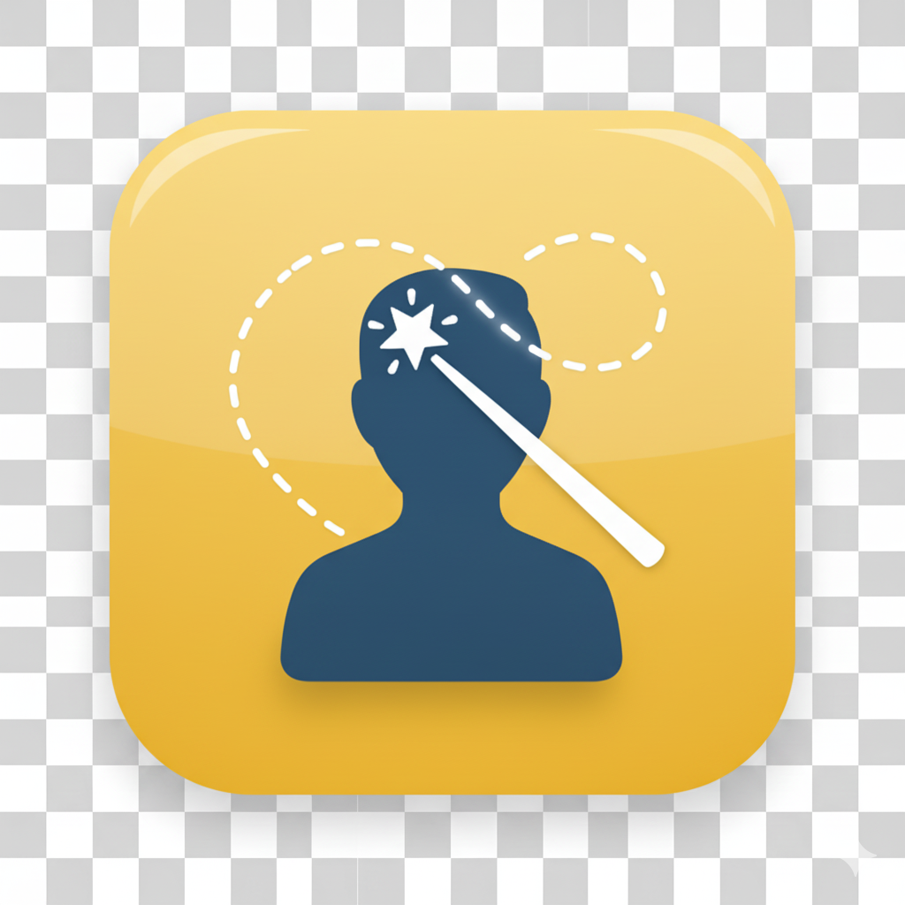

# ✂️ Advanced Background Remover App

This is a web-based application built with Streamlit that allows users to easily remove the background from images. It features a simple drag-and-drop interface and advanced fine-tuning controls to achieve high-quality results. The application leverages the powerful `rembg` library and can utilize a CUDA-enabled GPU for accelerated processing.

## Features

-   **Interactive UI**: Simple and intuitive web interface powered by Streamlit.
-   **Drag & Drop**: Easily upload images by dragging them onto the uploader.
-   **GPU Acceleration**: Automatically uses a CUDA-enabled GPU if available for fast processing.
-   **Fine-Tuning Controls**: A sidebar with settings to refine the output and reduce artifacts.
    -   **Alpha Matting**: Enable or disable advanced edge-refinement for cleaner cutouts.
    -   **Foreground/Background Thresholds**: Sliders to adjust the sensitivity of the segmentation mask.
    -   **Erode Size**: A slider to shrink the mask and remove background halos around the subject.
-   **Real-time Preview**: See the original and processed images side-by-side.
-   **Download Result**: Download the final image with a transparent background as a PNG file.

## Prerequisites

-   Python 3.8 or newer
-   An NVIDIA GPU with CUDA installed (for GPU acceleration)
-   `pip` for managing Python packages

## Installation

1.  **Clone the repository or download the project files.**

2.  **Create and activate a virtual environment (recommended):**
    ```bash
    # For Unix/macOS
    python3 -m venv venv
    source venv/bin/activate

    # For Windows
    python -m venv venv
    .\venv\Scripts\activate
    ```

3.  **Install the required Python libraries using the `requirements.txt` file:**
    ```bash
    pip install -r requirements.txt
    ```
    This command will install Streamlit, PyTorch with CUDA support, `rembg` with GPU capabilities, and other necessary dependencies.

## Usage

1.  **Navigate to the project directory** in your terminal.

2.  **Run the Streamlit application:**
    ```bash
    streamlit run background_remover_app.py
    ```

3.  **Open your web browser** and go to the local URL provided by Streamlit (usually `http://localhost:8501`).

4.  **Upload an image** using the file uploader.

5.  **Adjust the settings** in the sidebar to fine-tune the result. The image will be reprocessed automatically when you change a setting.

6.  **Click the "Download Processed Image" button** to save the final image.

## Explanation of Fine-Tuning Controls

-   **Enable Alpha Matting**: This turns on a sophisticated algorithm that cleans up the edges of the foreground object (e.g., hair, fur). It produces a much higher quality result but is slightly slower.
-   **Foreground Threshold**: Controls how aggressively the algorithm identifies a pixel as part of the foreground. Higher values are stricter.
-   **Background Threshold**: Controls how aggressively the algorithm identifies a pixel as part of the background. Lower values are stricter.
-   **Erode Size**: Shrinks the final foreground mask by a few pixels. This is very useful for removing small, unwanted background artifacts or "halos" around the subject.
